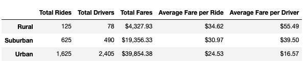

# PyBer_Analysis
## Overview of the PyBer Analysis
### Purpose
The purpose of this project is to find the differences of PyBer's ride sharing data by each city type (urban, suburban, and rural) and make recommendations to the CEO of PyBer. In order to find the differences, I created a ride-sharing summary by city type and a graph to depict the weekly total fares for each city type. 

## Results
Urban has the highest number of total rides, total drivers, and total fares, and it has the lowest average fare per ride and the average fare per driver. Suburban has the next highest number of total rides, total drivers, and total fares, and it has the next lowest average fare per ride and the average fare per driver. Finally, rural has the lowest number of total rides, total drivers, and total fares and it has the highest average fare per ride and the average fare per driver. 

PyBer Summary

	
## Summary

As shown on the PyBer summary, rural has more rides than drivers, which might cause the delay of the ride request due to shortage of drivers. I would recommend to promote more drivers in rural area so customer's request for ride can be processed faster. Suburban also has more rides than drivers like rural. I also would recommend to promote more drivers in suburban area so it could shorten the ride request time. Unlike rural and suburban, urban has more drivers than rides, which meant some drivers did not have any rides at all. I would recommend to make coupons or promo codes for the rides in urban area, so the number of rides could be increased.  

